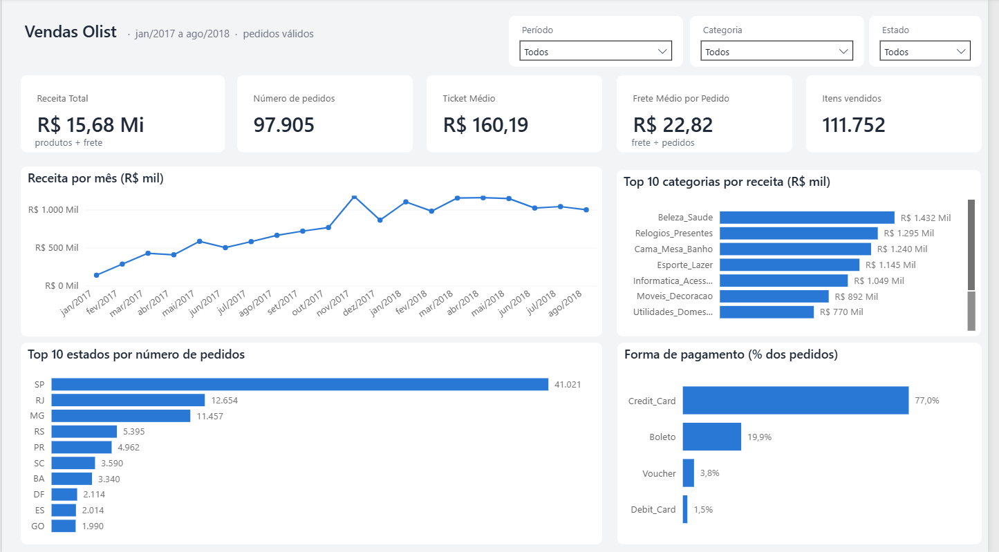
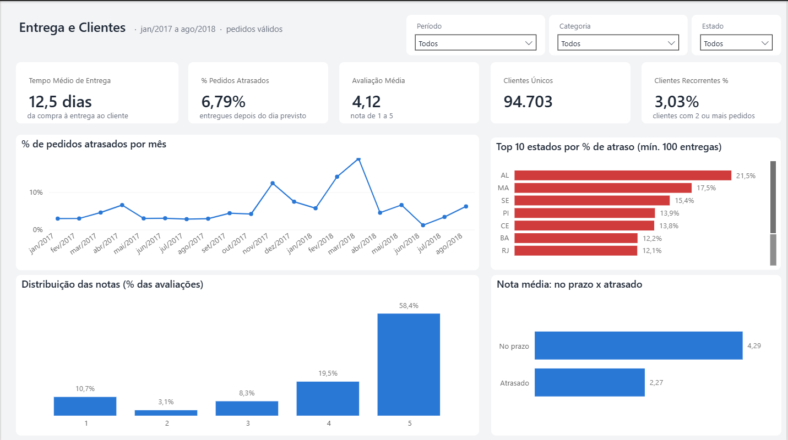

# 🎨 Design do Dashboard — Power BI

Este documento explica **como o dashboard foi pensado**: a estrutura das páginas, o estilo visual e o motivo de cada escolha de gráfico. Quem abrir o projeto consegue entender o raciocínio e reproduzir ou ajustar o painel.

> KPIs: [`kpis.md`](kpis.md) · Perguntas de negócio: [`business_questions.md`](business_questions.md) · Dicionário de dados: [`data_dictionary.md`](data_dictionary.md)

**Ferramenta:** Power BI Desktop, lendo os CSVs tratados de `data/processed/` (projeto pronto em [`../dashboard/`](../dashboard/README.md))  
**Status:** concluído. O painel foi construído a partir deste modelo (capturas na seção 9) e validado contra um recálculo independente (veja [`qa_signoff.md`](qa_signoff.md)).

---

## 1. Objetivo e público

**O dashboard responde:** como estão as vendas, a entrega e a satisfação dos clientes do e-commerce Olist, e onde agir para melhorar?

| | |
|---|---|
| **Público principal** | Gestão comercial e diretoria: querem ver os números sem precisar filtrar |
| **Público secundário** | Operações e logística |
| **Uso** | Consulta mensal e sob demanda (os dados são um histórico fixo) |

---

## 2. Como a estrutura foi pensada

Quatro princípios guiaram o desenho:

1. **Uma pergunta por página.** Um dashboard que tenta responder cinco perguntas não responde nenhuma bem. Por isso são 2 páginas, cada uma com uma pergunta clara.
2. **Do geral para o detalhe.** Em cada página: números-chave no topo, tendência no meio, quebras por categoria ou estado embaixo. Quem lê só o topo já entende a situação.
3. **O gráfico certo para cada tarefa.** O tipo de gráfico vem do que o leitor precisa fazer (comparar, ver tendência, ver proporção), não do que parece bonito.
4. **Poucas cores, com significado.** Azul para os dados, cinza para o contexto e vermelho só para o que é ruim.

### Por que 2 páginas

Os 12 KPIs do projeto se dividem naturalmente em dois assuntos:

| Página | Pergunta | Áreas de negócio | KPIs |
|---|---|---|---|
| **1. Vendas** | Quanto vendemos, o quê e onde? | Comercial, Financeiro, Produtos | Receita Total, Número de Pedidos, Ticket Médio, Frete Médio, Produtos Vendidos, Categoria com Maior Receita, Forma de Pagamento Mais Utilizada |
| **2. Entrega e Clientes** | Entregamos no prazo, e os clientes voltam e ficam satisfeitos? | Logística, Clientes | Tempo Médio de Entrega, % de Pedidos Atrasados, Avaliação Média, Clientes Únicos, Clientes Recorrentes (%) |

Sete KPIs na página 1 e cinco na página 2: nenhuma página passa de 12 elementos, o que mantém a leitura rápida.

---

## 3. Estilo visual

### Tela e grade

| Item | Definição |
|---|---|
| Formato | 16:9 (1280 × 720) |
| Margem da página | 24 px |
| Espaço entre visuais | 16 px (usar *Formatar → Alinhar/Distribuir*) |
| Fundo da página | Cinza muito claro, `#F3F4F6` |
| Visuais | Fundo branco `#FFFFFF`, cantos de 8 px, sem sombra e sem borda |

### Tipografia

Fonte **Segoe UI** em todo o painel.

| Elemento | Tamanho |
|---|---|
| Valor dos cartões (KPI) | 28–32, semibold |
| Título da página | 18, semibold |
| Título do gráfico | 12, semibold |
| Rótulos e eixos | 10, cinza `#6B7280` |

### Paleta

| Uso | Cor | Hex |
|---|---|---|
| Série principal (quase tudo) | Azul | `#2A78D6` |
| Contexto e itens secundários | Cinza | `#CBD5E0` |
| Segunda série (só quando houver duas) | Laranja | `#EB6834` |
| Ruim, atraso (status) | Vermelho | `#D03B3B` |
| Bom (status) | Verde | `#0CA30C` |
| Texto principal | Cinza escuro | `#1F2937` |
| Gradiente (mapa, matriz) | Um tom só: azul claro → escuro | `#CDE2FB` → `#104281` |

Regras de uso das cores:

- **Uma série, uma cor.** Barras de uma categoria só ficam todas azuis. Não colorir as barras pelo valor, porque o comprimento já mostra isso.
- **Destaque em vez de arco-íris.** Para chamar atenção para um item, ele fica em azul e o resto em cinza.
- **Vermelho e verde só para status**, sempre acompanhados de seta, ícone ou texto, nunca só a cor (acessibilidade para daltonismo).
- **Máximo de 8 cores** em qualquer gráfico; passando disso, agrupar em "Outros".

### Tema do Power BI

Para aplicar a paleta, salve o bloco abaixo como `.json` e importe em *Exibição → Temas → Procurar temas*:

```json
{
  "name": "TechStore",
  "dataColors": ["#2a78d6","#eb6834","#1baf7a","#eda100","#e87ba4","#008300","#4a3aa7","#e34948"],
  "background": "#FFFFFF",
  "foreground": "#1F2937",
  "tableAccent": "#2a78d6",
  "good": "#0ca30c",
  "neutral": "#fab219",
  "bad": "#d03b3b",
  "minimum": "#cde2fb",
  "center": "#6da7ec",
  "maximum": "#104281"
}
```

### Regras dos gráficos

- Valores escritos **direto nas barras** e nos picos das linhas, em vez de depender do eixo.
- Grade bem clara e sem linhas de eixo desnecessárias.
- Título do gráfico diz **o que ele mostra** e a unidade (ex.: "Receita por mês (R$)").
- Barras partem sempre do zero.
- **Gráfico de barras com 10 categorias precisa de cerca de 250 px de altura**, porque o Power BI reserva no mínimo 20 px por barra. Com menos altura aparece uma barra de rolagem. Por isso, no painel final, os gráficos Top 10 de categorias (aba Vendas) e de estados por atraso (aba Entrega e Clientes) ficam na linha de baixo, que é mais alta, e os gráficos de poucas barras (forma de pagamento e nota média) ficam na linha de cima.

---

## 4. Página 1 — Vendas

**Pergunta:** quanto vendemos, o quê e onde?

```
┌──────────────────────────────────────────────────────────────────┐
│ Vendas Olist · jan/2017 a ago/2018    [Período] [Estado] [Categoria]│
├───────────┬───────────┬───────────┬───────────┬──────────────────┤
│ Receita   │ Pedidos   │ Ticket    │ Frete     │ Itens vendidos   │
│ Total     │           │ Médio     │ Médio     │                  │
├───────────┴───────────┴───────────┴───┬───────┴──────────────────┤
│  Receita por mês (linha)              │ Forma de pagamento       │
│                                       │ (barras)                 │
├───────────────────────────────────────┼──────────────────────────┤
│  Top 10 estados por pedidos (barras)  │ Top 10 categorias        │
│                                       │ por receita (barras)     │
└───────────────────────────────────────┴──────────────────────────┘
```

| Visual | Gráfico | Campos | Motivo da escolha |
|---|---|---|---|
| **Receita Total** | Cartão grande, com legenda curta abaixo do valor | Receita Total | É o número principal: maior e no canto superior esquerdo, onde o olho começa |
| **Pedidos, Ticket Médio, Frete Médio** | Cartões | Respectivas medidas | Número direto, sem necessidade de gráfico |
| **Itens vendidos** | Cartão | Produtos Vendidos | Contagem simples. A categoria líder e a forma de pagamento mais usada aparecem nos gráficos de barras (as medidas continuam no modelo) |
| **Receita por mês** | Linha, com marcadores nos pontos | Mês × Receita Total | Mostra tendência e sazonalidade. Pedidos e ticket médio ficam no tooltip, **sem eixo duplo**, que sugere correlação onde não há |
| **Top 10 categorias** | Barras horizontais, uma cor, valores nas barras | Categoria (nome em português) × Receita Total | Nomes longos cabem melhor em barra horizontal, e a ordenação mostra o ranking |
| **Top 10 estados** | Barras horizontais | Estado do cliente × Número de Pedidos | Ranking mais preciso que mapa; um estado (SP) concentra cerca de 40% dos pedidos |
| **Forma de pagamento** | Barras horizontais, em % dos pedidos | Tipo de pagamento × % dos pedidos | Uma forma domina (cartão de crédito, cerca de 77%), e em barras isso aparece melhor do que em rosca |

---

## 5. Página 2 — Entrega e Clientes

**Pergunta:** entregamos no prazo, e os clientes voltam e ficam satisfeitos?

```
┌──────────────────────────────────────────────────────────────────┐
│ Entrega e Clientes                    [Período] [Estado] [Categoria]│
├────────────┬────────────┬────────────┬────────────┬──────────────┤
│ Tempo médio│ % Pedidos  │ Avaliação  │ Clientes   │ Clientes     │
│ de entrega │ atrasados  │ média      │ únicos     │ recorrentes %│
├────────────┴────────────┴────────────┼────────────┴──────────────┤
│ % atrasados por mês (linha)          │ Nota média: no prazo x    │
│                                      │ atrasado (barras)         │
├──────────────────────────────────────┼───────────────────────────┤
│ Distribuição das notas 1–5 (colunas) │ Top 10 estados por        │
│                                      │ % de atraso (barras)      │
└──────────────────────────────────────┴───────────────────────────┘

> Os gráficos de 10 barras ficam na linha de baixo, que é mais alta: o Power BI usa no mínimo 20 px por barra e, na linha de cima, apareceria uma barra de rolagem.
```

| Visual | Gráfico | Campos | Motivo da escolha |
|---|---|---|---|
| **5 cartões** | Cartão (o de atrasos com seta ou ícone de status) | Tempo Médio de Entrega, % Pedidos Atrasados, Avaliação Média, Clientes Únicos, Clientes Recorrentes % | Cada um responde uma pergunta de negócio sem esforço |
| **% atrasados por mês** | Linha, com marcadores nos pontos | Mês × % atrasados | Mostra *quando* a operação quebrou (o pior mês foi março/2018, com 19,0%) |
| **Top 10 estados por atraso** | Barras horizontais | Estado × % atrasados | Mostra *onde* agir (concentrado no Nordeste). **Filtrar por volume mínimo** (ex.: 100 pedidos entregues) para não destacar estado com poucos pedidos |
| **Nota média: no prazo x atrasado** | Barras com 2 categorias e valores nas barras | Situação da entrega × Avaliação Média | É a mensagem mais forte da página: pedidos atrasados têm nota média por volta de 2,3 contra cerca de 4,3 no prazo |
| **Distribuição das notas** | Colunas de 1 a 5 | Nota × % das avaliações | Mostra a forma da satisfação (a nota 5 domina) |

> A relação entre atraso e nota é uma **associação** observada nos dados. Ela não prova que o atraso causa a nota baixa, e o painel não deve afirmar isso.

---

## 6. Interações

| Recurso | Uso |
|---|---|
| **Segmentações** | Período, Estado e Categoria, no topo e **sincronizadas** entre as duas páginas (*Exibição → Sincronizar segmentações*). Três filtros bastam para um público não técnico |
| **Filtro cruzado** | Ligado entre os visuais da mesma página. Se um gráfico confundir, ajustar em *Editar interações* |
| **Tooltips** | Guardam o que não cabe na página (pedidos e ticket médio no gráfico de receita, por exemplo) |
| **Detalhamento (drill)** | Categoria → produto e ano → mês. O dataset não tem nome de produto, só `product_id` |

---

## 7. O que evitar

| Evitar | Problema | Em vez disso |
|---|---|---|
| Eixo duplo (dois eixos Y) | Cria uma falsa sensação de correlação | Dois gráficos, ou a medida extra no tooltip |
| Rosca ou pizza com mais de 4 fatias | Fatias pequenas ficam ilegíveis | Barras horizontais |
| Gráfico 3D | Distorce os tamanhos | Gráfico 2D |
| Medidor (gauge) | Ocupa espaço para mostrar um número | Cartão com seta |
| Barras coloridas por valor | Repete a informação do comprimento | Uma cor só, com destaque quando preciso |
| Eixo que não começa em zero (em barras) | Exagera diferenças | Barras sempre a partir do zero |
| Mais de 8 cores | Obriga a olhar a legenda o tempo todo | Agrupar em "Outros" |

---

## 8. Cuidados com os dados que mudam os números

Recomendações para os números do painel ficarem corretos e comparáveis:

1. **Janela de tempo:** 2016 e set–out/2018 têm quase nenhum pedido; mostrá-los distorce a tendência. Recomenda-se filtrar de **2017-01 a 2018-08**.
2. **Receita:** somar `price + freight_value` dos **itens** (`order_items`) e excluir pedidos `canceled` e `unavailable`. Somar `payment_value` depois de juntar com os itens duplica valores, porque um pedido tem vários itens e vários pagamentos.
3. **Atraso:** comparar a entrega com a data estimada pelo **dia** (a data estimada não tem horário) e só para pedidos `delivered` com data de entrega.
4. **Cliente:** usar `customer_unique_id`. O `customer_id` muda a cada pedido.
5. **Forma de pagamento:** excluir o tipo `not_defined` ao calcular a mais usada.
6. **CEP:** manter como texto para não perder o zero à esquerda.

Mais detalhes sobre a limpeza em [`data_cleaning.md`](data_cleaning.md).

---

## 9. Imagens do painel

**Página 1 — Vendas**



**Página 2 — Entrega e Clientes**



**Modelos de referência** usados como guia antes de montar o painel: [`modelo_pagina1_vendas.png`](images/modelo_pagina1_vendas.png) e [`modelo_pagina2_entrega_clientes.png`](images/modelo_pagina2_entrega_clientes.png).
